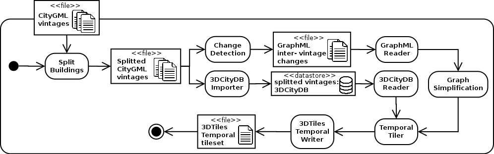

This application allows to compute 3DTiles tilesets out of the city of Lyon cityGML files. Instructions for running the computation can be found [here](PythonCallingDocker/Readme.md) and the Docker contexts used in the computation can be found [here](Docker).

The full pipeline of this computation is described by the following [UML activity diagram](https://www.uml-diagrams.org/activity-diagrams.html):

